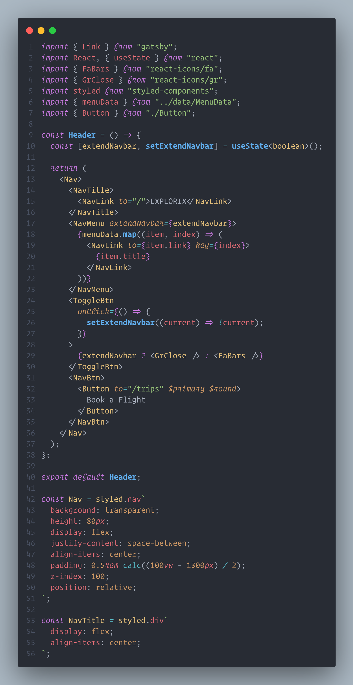

<!--
 * @Description  : Readme
 * @Author       : ch1lam
 * @Date         : 2022-04-29 15:54:25
 * @LastEditTime : 2022-04-29 16:59:59
 * @LastEditors  : chilam
 * @FilePath     : \Operator-Mono-Lig\README.md
-->

# Operator-Mono-Lig

支持连字符的 Operator Mono font

基于[该项目](https://github.com/kiliman/operator-mono-lig)生成的 Operator Mono Lig 字体

### 使用
1. 下载并安装OTF字体
2. 配置vscode
```json
"editor.fontFamily": "Operator Mono Lig" // 默认是light字体
"editor.fontLigatures": true, // 开启连字符
"editor.tokenColorCustomizations": { // 关键词斜体
    "textMateRules": [
      {
        "name": "italic font",
        "scope": [
          "comment",
          "keyword",
          "storage",
          "entity.other",
        ],
        "settings": {
          "fontStyle": "italic"
        }
      }
    ]
  },
```

### 效果



### 我的完整配置
```json
"workbench.colorTheme": "One Dark Pro Flat",
"editor.fontFamily": "'Operator Mono Lig','Fira Code','SauceCodePro Nerd Font Mono','Source Han Sans HW SC','Helvetica Neue','PingFang SC',Consolas, 'Courier New', monospace",
"editor.fontLigatures": true,
"editor.tokenColorCustomizations": {
    "textMateRules": [
      {
        "name": "italic font",
        "scope": [
          "comment",
          "keyword",
          "storage",
          "entity.other",
        ],
        "settings": {
          "fontStyle": "italic"
        }
      }
    ]
  },
```
